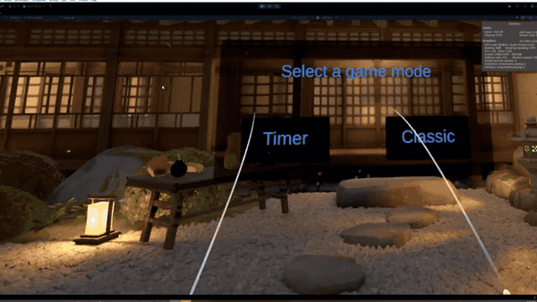
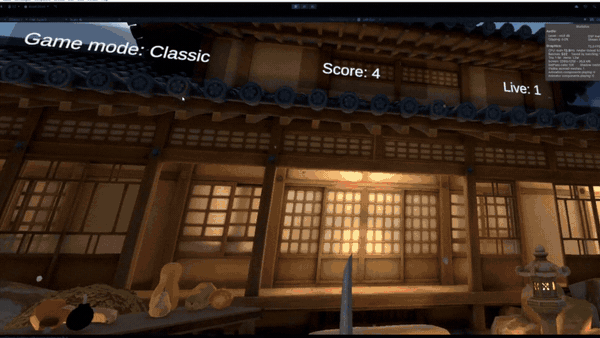
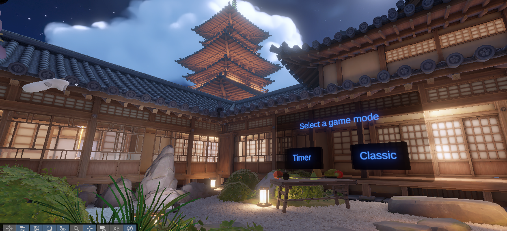
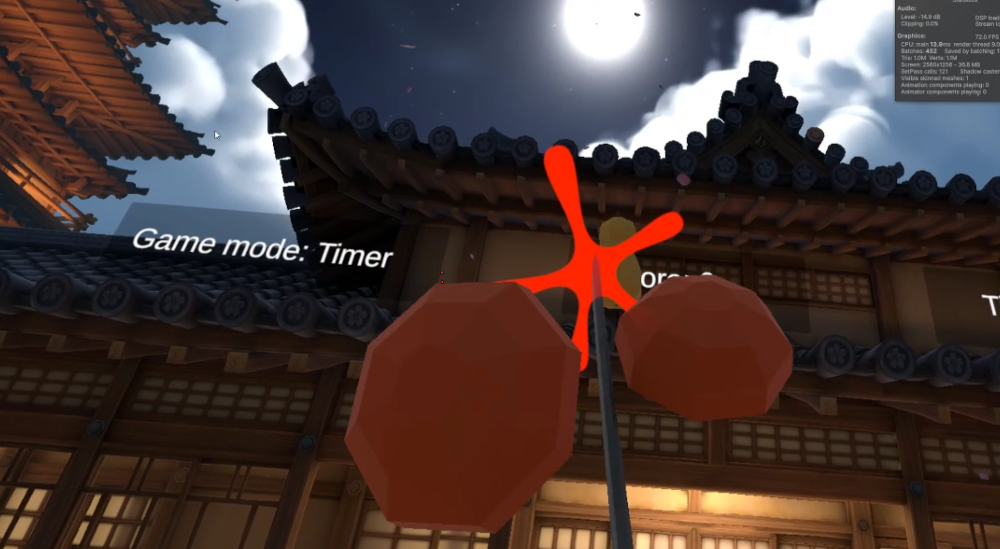
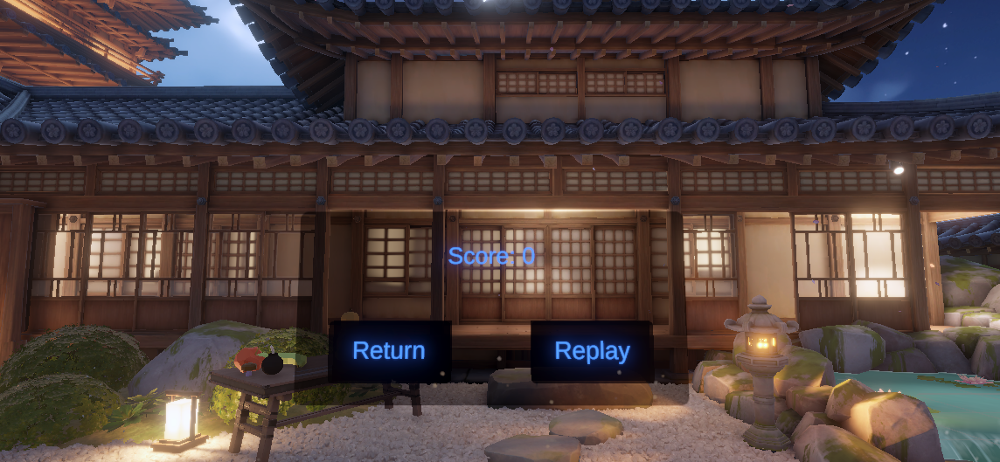

# Fruit Ninja VR

Fruit Ninja-inspired VR game made in Unity for Meta Quest 3.

## Features
- Classic and Timer game modes
- VR katana interaction
- Fruit slicing with physics
- Score, lives and bomb mechanics

## Screenshots

## Gameplay

[Watch on YouTube](https://www.youtube.com/watch?v=uzujFWYeiEE)

## Technical Details

Unity, C#, XR Interaction Toolkit, URP, Meta Quest 3

[Development document (Sadly only in Dutch)](https://docs.google.com/document/d/1PItWUHxDTpTfXV7BmXayFbO1SEia-nBI/edit?usp=sharing&ouid=100925978281662341608&rtpof=true&sd=true)
